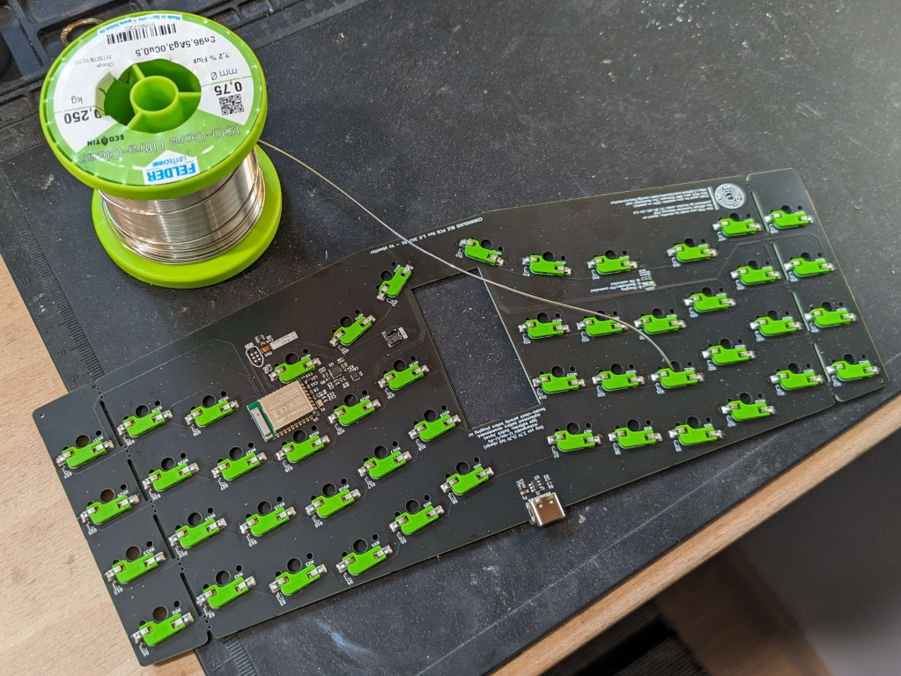
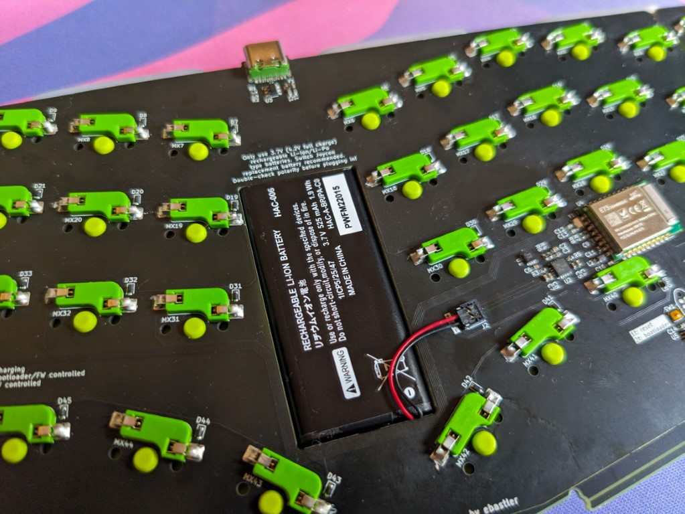

# Cornholius Keyboard

Cornholius is, first and foremost, a Bluetooth Low Energy capable replacement PCB for the [Foostan Cornelius](https://github.com/foostan/corneliuskbd). Key and connector positions as well as PCB outline and plate were derived from the original Cornelius repository, but altered to fit the scope of this project - Thank you for open sourcing these files! In accordance with the license chosen by foostan, this project was published under the same license.

It is designed to run on [ZMK Firmware](https://github.com/zmkfirmware/zmk), with the firmware sources being located in a [zmk-config fork in my account](https://github.com/ebastler/zmk-config/tree/cornholius-a). Please note that both the firmware and the repository as a whole is still a work in progress. The PCBs and plates themselves are tested, but have not been tested in an original Cornelius enclosure yet, and clearance issues may arise between the RF module and the keyboard bottom case. I will update the repository once everything has been tested.

Parts of this project:
* [PCB](./hotswap_ble/) [100%]
* [Plate](./plate_ble/) [100%]
* 3D printable cornelius/cornholius PCB compatible case [WIP]

## Cornholius PCB
The PCB is designed to be 100% assemblable by jlcpcb in their "economic" PCBA option (without hotswap sockets), or the more expensive "standard" PCBA option incl. hotswap sockets. It uses an [Ebyte nRF52840_E73-2G4M08S1C](https://www.ebyte.com/en/downpdf.aspx?id=445) BLE module, which is part of their component library, so no external components must be ordered from other shops. This module is configured for full 2-stage DC-DC operation in high voltage mode for maximum battery life.

Battery management is handled by a [TI BQ24075](http://www.ti.com/lit/ds/symlink/bq24075.pdf) battery management/power path IC, with a charge current of approx. 440 mA and all relevant protections in place. The PCB is designed for a HAC-006 (Nintendo Switch Joycon) battery, as replacement cells for it are affordable and easy to source, and are plug and play for Cornholius, incl. the right connector. It should lead to an estimated battery life of up to 8 months (according to ZMK power profiler).

If you want to use any other battery type, make sure it has a Molex Pico EZmate 2-pin connector, and the correct polarity. Connecting a battery with mismatched polarity may damage the PCB and can potentially turn into a fire hazard.

The 6th column on the PCB can be snapped off, turning it into a 5col PCB.

### Programming
Flashing an nRF52840 forn the first time requires hardware tools. Joric wrote up a very good guide on how to program nRF52 series chips in the [nrfmicro github wiki](https://github.com/joric/nrfmicro/wiki/Bootloader). If you have never flashed a nRF52 series chip before, I suggest reading it before proceeding to order any hardware.

The PCB features a TC2030 flashing header footprint, configured in [TC2030-CTX-NL](https://www.tag-connect.com/wp-content/uploads/bsk-pdf-manager/TC2030-CTX_1.pdf) pinout. It should be possible to solder wires to this footprint and connect to a debug probe, but I have not tried. 

Precompiled bootloader files can be found in the Github Actions tab of my [fork of the Adafruit nRF52 Bootloader](https://github.com/ebastler/Adafruit_nRF52_Bootloader/actions).

Once the PCBs have a bootloader, they can be programmed via a UF2 mass-storage-device bootloader. Double-tapping the reset button (or using keybinds, once ZMK is running) will send the device to bootloader. 

### Ordering
Gerber files and assembly files can be found in the [hotswap_ble/fab subfolder](./hotswap_ble/fab/). Use 1.6mm FR4 substrate.

The jlcpcb assembly files are tested and were working at the time when I ordered prototypes, however, jlcpcb sometimes changes part numbers, or parts run out of stock and need to be replaced by new parts. Please proceed with caution and carefully check both BOM and position/alignment/orientation of all components when uploading to their site.

## Cornholius Plate
The plate is made from FR4 substrate, without any copper plating, to minimie interference with the antenna. It also has a hole above the PCB's status LED to keep it visible. While it is compatible with Cornelius cases, the outline and the gasket tabs were slightly altered from the original Cornelius plate to allow for o-ring mount in Cornholius.

### Ordering
Gerber files and assembly files can be found in the [plate_ble/fab subfolder](./plate_ble/fab/). Use 1.6mm FR4 substrate.

## Cornholius Case
tbd

This case will be designed to fit Cornholius and Cornelius PCBs, but only work with Cornholius plates due to the mounting design. While it will follow the Cornelius shape out of necessity, I want to give it a distinct design, setting it apart from the original. This section will be updated once the design is finalized.